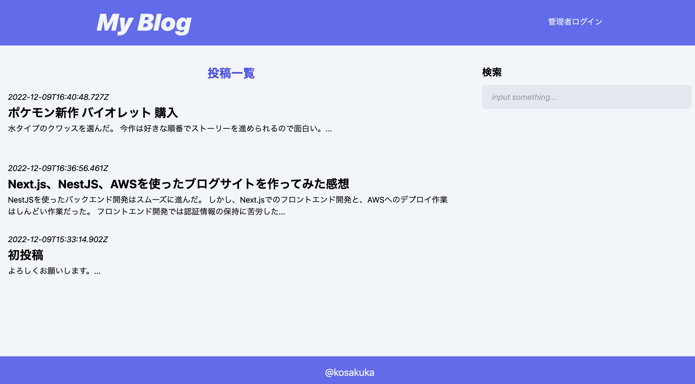

# Next.js × NestJS × AWS で作成したブログサイト
## URL
[サイトURL](https://nest-next-blog.vercel.app/)

## 概要
単純なブログサイトです。特徴としては、
- バックエンド(DBとの連携、JWTトークンの発行)に、目標設定で課題としたNestJSを使用した
- インフラに、目標設定で課題としたAWSを使用した
- フロントエンドにNext.jsを使い、シングルページアプリケーション(画面遷移の際、ブラウザがリロードされない仕組み)を実現した

## 機能
- 記事一覧
- 記事詳細
- 検索機能
- 管理者ログイン
- 投稿・更新・削除 (要ログイン)

## 使用技術
### フロントエンド
- TypeScript (言語)
- Next.js (フレームワーク)
- TailwindCSS (cssフレームワーク)
### バックエンド
- TypeScript (言語)
- NestJS (フレームワーク)
- Prisma (ORM)
- PostgreSQL (DB)
### インフラ
- AWS (NestJSのデプロイにはEC2、DBのデプロイにはRDS、ロードバランサーにはELB、ドメイン設定にRoute53、証明書発行にCertificate Managerを使用)
- Vercel (フロントエンドのデプロイ)

### 開発環境
- Docker
- docker-compose

## インフラ構成図

## 苦労した点
### フロント 認証情報の保持方法
当初は状態管理ツールであるReduxを使い、JWTトークンをグローバル変数的に持たせるつもりだった。

しかし、普通のReactだとそれでうまくいくものの、Nextだと「hydration error」というエラーになってしまった。

結局は、cookieに保持したJWTトークンをページ遷移毎に読み込む方法を取った。
### EC2へのNestJSデプロイ
NestjsのEC2デプロイの方法として、
- Node.jsのインストール
- git clone
- envファイル作成

といった泥臭い作業を2インスタンス分行った。

実務では、もっと多数のインスタンスを立てる必要があると予想しており、今回のような作業を全インスタンスに行っていたらきりがないと感じた。

そのため今後は、github actions等を使った自動デプロイも勉強してみようと考えている。
### AWSのインフラ構成変更により生じた不具合
当初、Next.jsもAWSにデプロイする予定だったが、費用の節約のために、フロントは無料インフラのVercelにデプロイするやり方に途中変更した。

しかし、フロント用のEC2やセキュリティグループを消したことにより、ドメインでの接続ができなくなってしまった。

(フロント用の層を消したことにより、接続するポート番号の設定が少々変わってしまったのが原因と考えている。)

ELB(ロードバランサー)やドメイン周りの設定を1からやり直した結果、なんとか復旧できたから良かったものの、安易に構成変更はしないほうがよいとしみじみ思った。